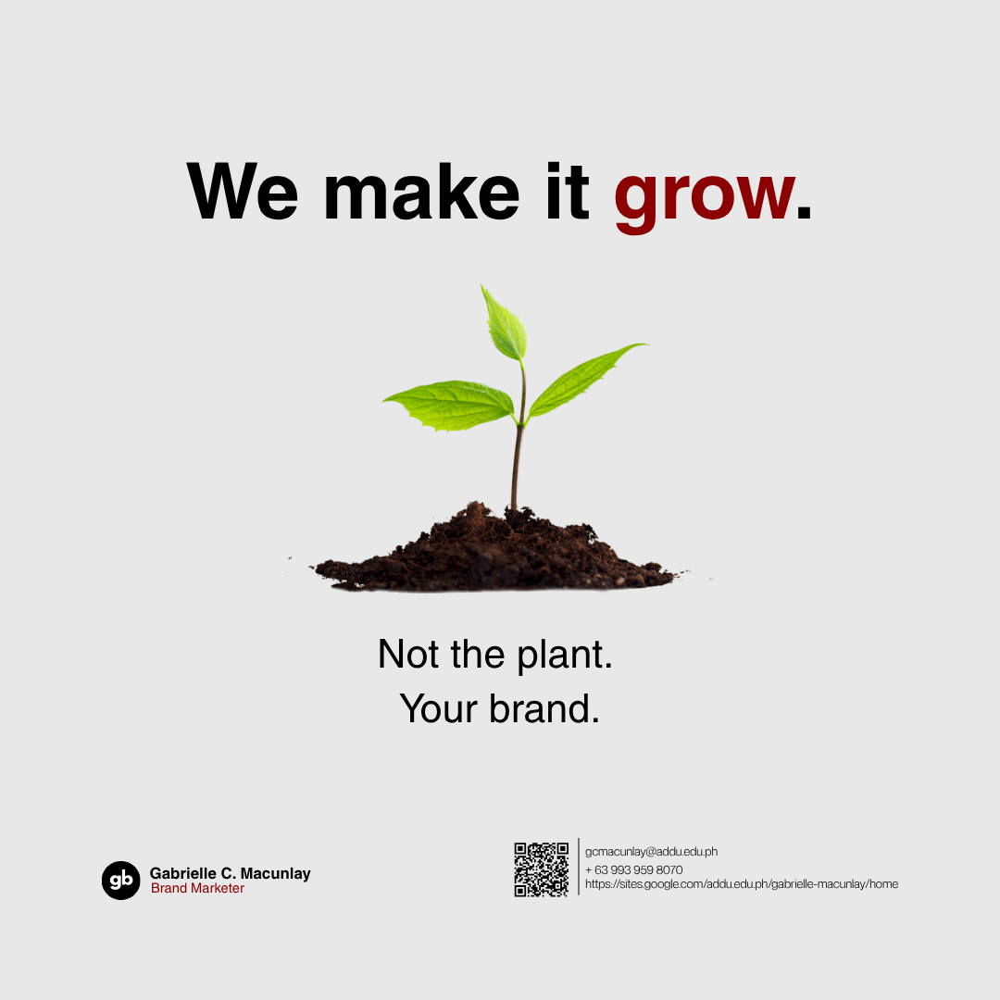

### GE: IT Skills Portfolio

I am an Interdisciplinary Studies student of Ateneo de Davao University. I am passionate about creating art. I do graphic design and film production, and I engage in performance arts in my spare time.

------------------------------------------------------------------------------------------------------------------------------------------------------------------

## My Design Projects

## Branding 

 
#### Logo
This is my official logo that uses the initials of my nickname which is 'Gabbie'. To make it simple, letters g and b are utilized to symbolize my name.

 

[Open PDF Document](branding/crap-activity.pdf)
 
#### CRAP Activity
This is the first design project for self-introduction. The Swiss typography art movements were my inspiration in making this design.

   

## Visuals 

 
#### Header Banner
This is my header banner for professional use. I stayed consistent on sticking with my color palette, which uses neutrals with red accents.

 

 
#### Promotional Graphic Poster
I applied minimalism to make the message clearer. I made use of the seedling as a photo to promote my skill in a more creative way.

   

## Docs 
[Open PDF Document](docs/vertical-infographic.pdf)
 
#### Vertical Infographic Poster
Just like in my previous designs, I sticked to my color palette with a twist of changing the orientation of the subheading text. This still applies the Swiss Typography art movement.

  

## Media 
<video src="media/video-introduction.mp4" controls width="100%"></video>

#### Self-Introduction Motion Graphic Video
In creating this motion graphics piece, I tried to design it with a fresh perspective. I combined both, following some rules of the Swiss art movement, and some of it is on how I can break those rules to add some twists to my video.

 

#### Website
https://gabriellemacunlay.my.canva.site/website-prototype
 
This website showcases the combination of all of my approaches of designing with observance of the same color palette, typography, and art movement inspiration.

   
###### Gabrielle C. Macunlay
<i> AB Interdisciplinary Studies minor in Media and Technology - 2A </i>

